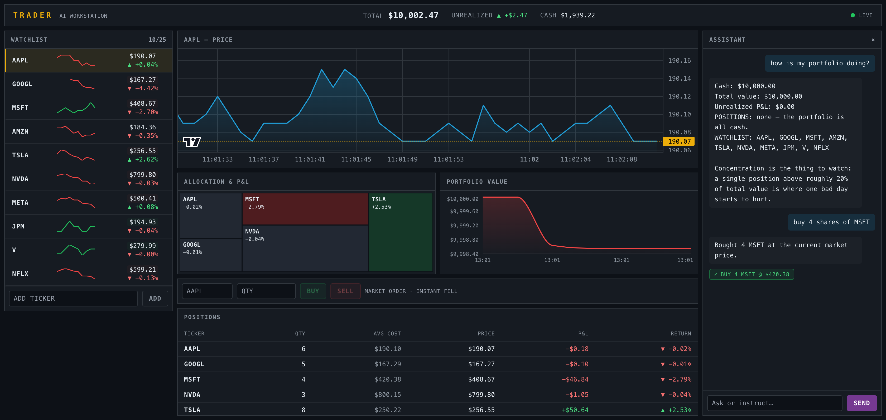

# Trader — AI Trading Workstation

A visually dense trading terminal: live streaming prices, a simulated $10,000 portfolio, and an
LLM assistant that can analyze your positions and execute trades on your behalf.

Everything runs in one container on one port. No login, no signup, no real money.



## Quick start

```bash
cp .env.example .env      # add your OPENROUTER_API_KEY
./scripts/start_mac.sh    # macOS/Linux  (scripts\start_windows.ps1 on Windows)
```

The app opens at <http://localhost:8000>. To stop it:

```bash
./scripts/stop_mac.sh
```

Both scripts wrap `docker compose`, so `docker compose up -d --build` and `docker compose down`
work identically if you prefer.

Your portfolio persists in `db/trader.db` between restarts. Delete that file, or use the in-app
reset, to start over.

## What you can do

- **Watch prices stream** — the watchlist updates twice a second, flashing green on an uptick and
  red on a downtick, with a sparkline building up beside each row.
- **Chart a ticker** — click any watchlist row. The chart seeds from the server's history buffer so
  it has shape immediately, then follows the stream live.
- **Trade** — ticker, quantity, buy or sell. Market orders, instant fill, no fees, no confirmation.
- **Watch your portfolio** — a treemap sized by position weight and coloured by P&L, a portfolio
  value chart, and a positions table with live return figures.
- **Talk to the assistant** — "how is my portfolio doing?", "buy 10 AAPL", "add PYPL to my
  watchlist". It executes trades directly, and shows each one inline as it happens.

## Configuration

All configuration is environment variables. `.env` is read for local development; Docker passes it
with `--env-file`.

| Variable | Required | Default | Purpose |
|---|---|---|---|
| `OPENROUTER_API_KEY` | For real chat | — | OpenRouter key. Without it the assistant falls back to mock responses. |
| `MASSIVE_API_KEY` | No | empty | Set to use real market data from Massive/Polygon. **Leave empty to use the built-in simulator**, which costs nothing and works offline. |
| `LLM_MOCK` | No | `false` | `true` gives deterministic assistant responses with no API calls. Used by the E2E suite. |
| `SIM_SEED` | No | unset | Seeds the simulator's RNG, making price paths reproducible. |
| `SIM_TICK_MS` | No | `500` | Simulator tick interval. The GBM time step is derived from it, so changing it does not distort volatility. |
| `MASSIVE_POLL_SECONDS` | No | `15` | Massive poll interval. The default suits the free tier's 5 calls/minute. |

### Market data

By default prices come from a geometric Brownian motion simulator with per-ticker volatility,
correlated sector moves, and occasional 2–5% shocks. It needs no API key and no network.

With `MASSIVE_API_KEY` set, prices come from real market data instead. Outside market hours real
quotes are static, so the display will look frozen and the flash animation will not fire. That is
expected — there is deliberately no automatic fallback to the simulator, because silently swapping
real data for synthetic data is worse than a still screen.

## Architecture

```
Docker container (port 8000)
├── FastAPI
│   ├── /api/*          REST
│   ├── /api/stream/*   Server-Sent Events
│   └── /*              the exported frontend
├── SQLite at db/trader.db (bind-mounted)
└── Background tasks: market data, history collection, portfolio snapshots
```

- **Frontend** — Next.js + TypeScript, built as a static export and served by FastAPI. One origin,
  so no CORS.
- **Backend** — FastAPI, managed with `uv`.
- **Real-time** — SSE rather than WebSockets: the data only flows one way.
- **LLM** — LiteLLM → OpenRouter → `openai/gpt-oss-120b` on Cerebras, with structured outputs.

## Development

```bash
# Backend
cd backend
uv sync --extra dev
uv run --extra dev pytest                  # 314 tests
uv run --extra dev ruff check app/ tests/
uv run uvicorn app.main:app --reload

# Frontend
cd frontend
npm install
npm test                                   # 56 tests
npm run dev

# E2E (needs Docker)
cd test
npm install && npx playwright install chromium
docker compose -f docker-compose.test.yml up -d --build
npx playwright test
```

To run the frontend against the backend during development, build it once (`npm run build`) and
point the backend at it with `STATIC_DIR=../frontend/out`.

## Documentation

| Document | What it is |
|---|---|
| `planning/API_CONTRACT.md` | The wire format. Frozen: every endpoint, the SSE payload, the error envelope. |
| `planning/DECISIONS.md` | Resolved design decisions, and why. Authoritative over `PLAN.md`. |
| `planning/PLAN.md` | The original product brief. |
| `planning/REVIEW.md` | A review pass that audited the plan against the shipped code. |
| `backend/CLAUDE.md` | Backend developer guide. |

## Safety note

The app has no authentication and executes trades without confirmation, so the container binds to
`127.0.0.1` only. It is a single-user demo with imaginary money; do not expose it to a network.
